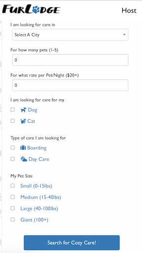
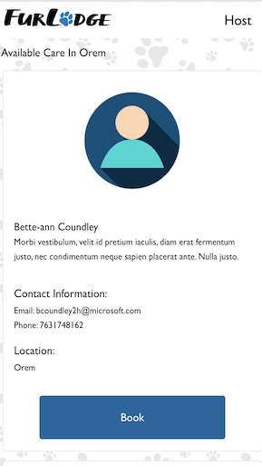

# FUR LODGE 
## -- An APP To Find A Loving Host For Our FURRRRIENDS
<hr>

  [](https://github.com/imbingz)
  [](https://github.com/imbingz/fur-lodge)
  [](https://github.com/imbingz/fur-lodge)
  [](https://choosealicense.com/licenses/mit/)
  [](https://nodejs.org/en/)
  [](https://www.npmjs.com/package/inquirer)

  ## Table of Content
  * [ Project Links ](#Project-Links)
  * [ Screenshots-Demo ](#Screenshots-Demo)
  * [ Project Objective ](#Project-Objective)
  * [ User Story ](#User-Story)
  * [ Technologies ](#Technologies)
  * [ Installation ](#Installation)
  * [ Usage ](#Usage)
  * [ Credits and Reference ](#Credits-and-Reference)
  * [ Tests ](#Tests)
  * [ Author Contact ](#Author-Contact)
  * [ License ](#License)
  #

  ##  Project Links

  ##### Deployed site on heroku: https://glacial-gorge-49813.herokuapp.com/
  
  ##### Github REPO link:  https://github.com/imbingz/fur-lodge

  ## Screenshots-Demo
  <kbd></kbd>
  <kbd></kbd>
  <kbd></kbd>
  <kbd></kbd>
  <kbd></kbd>
  <kbd></kbd>
  <kbd></kbd>
  
  ## Project Objective
  * To create an Airbnb-like pet boarding marketplace connecting pet owners with people(hosts) who are willing to take care of the pets while their owners are away. Find our beloved furriends a real home to stay and play when we are away. 
  * It uses express-handlebars, Foundation CSS framework and jQuery lirary for the front-end.
  * It utilizes node.js, express.js, express-session, bcryptjs, passport, passport-local strategy, sequelize, mysql2 for the back-end. 
  * It features a mobile-first, a clean and polished user interface and adapts to multiple screen sizes.
  * It applies ARIA accessibility rules and guidelines
  
  ## User Story
  AS A dog-owner, I WANT to find someone or a family who loves dogs as much as me and is willing to take care of my dogs as needed while making money, SO THAT I can focus on my trip with less worries about my dogs. I WANT to see the available hosts who meet my criteria such as budget, care types, number of pets willing to host in my specified city without having to sign up for an account; I WANT to see the host contact and book it directly on the application. 


  ## Technologies 
  ```
  node.js, npm, express.js, express-session, bcryptjs, passport, passport-local strategy,
  ```
   ```
 sequelize, mysql2, express-handlebars, Foundation CSS framework, jQuery and heroku. 
  ```
  
  ## Installation
  Access to GitHub.com and a code editor such as vscode is necessary. Click the GitHub link provided above to the APP REPO. Click on the green button that says Clone or Download and Choose how you would like to download: using the SSH/HTTPS keys or download the zip file. If using SSH/HTTPS Key: You will copy the link shown and open up either terminal (mac: pre-installed) or gitbash (pc: must be installed). Once the application is open, you will type git clone paste url here. If using Download ZIP: Click on Download Zip. Locate the file and double click it to unzip the file. Locate the unzipped folder and open it. 

  ## Usage 
  There are two ways your can run this APP. One is to go to [the deployed site](https://glacial-gorge-49813.herokuapp.com/). Another is to run it on your local machine through a localhost PORT. First, you need terminal (mac: pre-installed) or gitbash (pc: must be installed). You also need to download and install [node.js](https://nodejs.org/en/) and [npm](www.npmjs.com) or [yarn](https://yarnpkg.com/) package manager. Open the cloned REPO in your favorite code editor, and then in terminal, enter the command “ npm i “ or “yarn add”  to install the dependencies. Make sure to create a .env file on the project root, and input your own Mysql Workbench config information (see the root file .env_example for samples). Now you are ready to start using  the app by entering “npm start” on your terminal or gitbash. 

  
  ## Credits and Reference
  The following links have helped us with this project. <br> [express-sessioon](https://www.npmjs.com/package/express-session) <br>  [Passport](http://www.passportjs.org/) <br>  [bcrypt](https://www.npmjs.com/package/bcryptjs) <br>  [How do sessions work in Express.js with Node.js?](https://stackoverflow.com/questions/5522020/how-do-sessions-work-in-express-js-with-node-js) <br> [sequelize](https://sequelize.org/master/index.html)  <br> [Foundation CSS Framework](https://get.foundation/) <br> [Mockaroo Data Generator](https://mockaroo.com/) <br> [Rover](https://www.rover.com/account/profile/details/)


  ## Challenges and Progress
  * Time constrain was one of the biggest challenges. Four of us had less than 2 weeks (besides working full time) to complete this project, from ideation to deployment and presentation. We had to cut down on features so that we could build a functional scooter rathan than an automobile that is broken. 
  * It is first time for any of us to build something of this scale, from front-end (using express-handlebars and Foundation CSS) to server (node.js express.js) to database connection (express sequelize, mysql2), along with new tools for authentication such as passport, passort-local startegy, express-session and password hashing such as bcryptjs. Any changes including the ones that improve the APP could cause unexpected bugs and hours of our time to fix the hugs. 
  * 


  ## Tests
  npm test

  ## Author Contact
  Contact the authors with any questions!<br>
  Github link: [imbingz](https://github.com/imbingz), [cboswel1](https://github.com/cboswel1), [tdmoore004](https://github.com/tdmoore004),  [vivid-green](https://github.com/vivid-green)<br>

  ## License
  This project is [MIT](https://choosealicense.com/licenses/mit/) licensed.<br />

   Copyright © 2020 FurBabiezzzz [Bing Z.](https://imbingz.github.io/Responsive-Website-Portfolio/), [Christian Boswell](https://github.com/cboswel1), [Tanner Moore](https://github.com/tdmoore004), [Zachary Creek](https://github.com/vivid-green)

  <hr>
  <p align='center'><i>
  This project was built with ❤️ by <a href="https://imbingz.github.io/Responsive-Website-Portfolio/"> Bing Z., </a> <a href="https://github.com/cboswel1"> Christian Boswell, </a><a href="https://github.com/tdmoore004"> Tannere Moore, </a><a href="https://github.com/vivid-green"> Zachary Creek</a>
</i></p>

